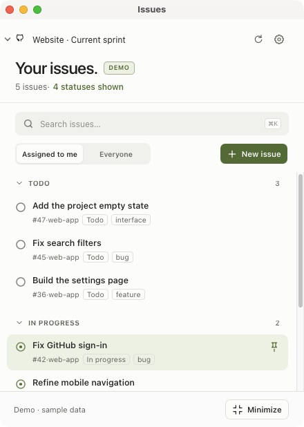

# Issues



**Issues** is a compact macOS companion for GitHub Projects. It brings project issues into a native AppKit and WKWebView app, with a floating launcher and focus capsule for keeping active work close. App-authored interface text is in English; GitHub content stays in its original language.

Issues supports GitHub Projects V2 at these URL formats:

- `https://github.com/users/USERNAME/projects/NUMBER`
- `https://github.com/orgs/ORGANIZATION/projects/NUMBER`

Classic GitHub boards are not supported.

## What you can do

### Browse projects and issues

- Connect multiple projects and switch between them with the same GitHub connection.
- See issues grouped under the project's actual status options. Choose which status sections are visible with the switches in Settings.
- Filter by **Assigned to me** or **Everyone**, search the project, and collapse status sections. Collapsed-section state is kept for each project and search during the current app session.
- Configure custom names for the **In progress** and **To do** groups. Status editing recognizes a project field named `Status` or `Stato` and uses that project's available options.
- Open an issue in a details modal to read its full, scrollable description. Change its project status or clear the status, and update assignees using users available from the selected repository.
- Keep open and closed repository issues available in their project sections. Archived items, drafts, and pull requests are excluded.

Changing a project status updates the project field; it does not close or reopen the repository issue. The demo is local: its edits never write to GitHub or replace the cache for a real project.

### Create issues

The issue composer supports a repository, Markdown description with preview, repository templates, multiple assignees, labels, a milestone, issue type, project status, additional projects, and parent or blocking relationships. Less-used metadata is in expandable sections. Use **Create another** to keep composing after a successful issue is created.

Choose images or videos with the native file picker. Issues uploads them when you submit the issue. A submission can include up to 10 media files; each image can be up to 10 MB and each video up to 100 MB. Non-media attachments and structured YAML issue forms use **Continue on GitHub**, which opens GitHub with the draft preserved.

When creating an issue for multiple projects, Issues sends the selected `projectV2Ids` with the create request, then applies the requested project status and relationships. If GitHub's project read has not caught up with the new association yet, Issues retries association recovery. If a step after issue creation fails, the app retains the created issue URL and does not create the issue again as part of recovery.

### Keep active work close

- Closing or minimizing the main window shows the floating icon. Hover over its count badge to see up to three in-progress issues. The preview remains open while the pointer is over it and closes after the pointer leaves.
- Pin an issue to keep it in the focus capsule. Pins are stored locally.
- Click the floating icon to reopen the main window. Drag the icon or capsule to move it.
- Press `⌘⇧I` to toggle the main window and floating icon. The macOS menu bar also offers the window modes and Quit.
- Use **Always on top** to control the window level. Animations respect macOS Reduce Motion.

Issues refreshes manually or every 60 seconds. If a refresh fails, it keeps the last cached data and shows its timestamp.

## Build from source

Requirements: macOS 13 or later, Xcode Command Line Tools, and Swift 5.9 or later. No npm installation is required.

```sh
git clone https://github.com/LucaCapasso22/Issues.git
cd Issues
bash scripts/build-app.sh
open release/Issues.app
```

Install the Command Line Tools with `xcode-select --install` if needed. To use CLI authentication, install [GitHub CLI](https://cli.github.com/) (for example, `brew install gh` if you use Homebrew).

To explore without connecting an account, choose **Explore with demo data** on the connection screen. You can also quit a running copy and launch with:

```sh
open release/Issues.app --args --demo
```

The build script uses a temporary directory to avoid compiler issues on exFAT volumes. Set `ISSUES_BUILD_DIR` to choose another temporary build directory.

## Connect to GitHub

Connect using the GitHub CLI account or a personal access token. For the CLI, Issues looks for `gh` in `/opt/homebrew/bin`, `/usr/local/bin`, or `PATH`.

Reading requires GitHub Projects read access (`read:project`). Editing a project requires the `project` scope and write access to that project. Creating an issue also requires Issues write access to the selected repository; private repositories using a classic CLI token require the `repo` scope.

For a first CLI connection, run these commands and approve the requested access in GitHub's browser flow:

```sh
gh auth login --hostname github.com --web
gh auth refresh -h github.com --scopes repo,project,read:org
```

For an existing CLI connection that already has repository access, add the Projects write scope with:

```sh
gh auth refresh -h github.com -s project
```

For personal access tokens, grant access to the relevant projects and repositories, including write access for editing. Issues stores a token in macOS Keychain only after a successful connection. Tokens are not stored in preferences, the project cache, or logs. Keep tokens private and never commit them to this repository.

## Local data, limits, and security

- Project caches are stored in `~/Library/Application Support/Issues/project-caches/`. The previous `project-cache.json` is migrated automatically.
- Preferences use `app.issues.desktop`; window position and size are remembered.
- Disconnect removes the current saved project. Disconnecting the last saved project also removes the shared token.
- Composer metadata lists are limited to the first 100 choices, with a warning when more are available. Repository suggestions include up to 100 linked repositories plus repositories found in project items; another repository can be entered when creating an issue.
- Structured forms and non-media files are completed on GitHub. The handoff keeps the in-app draft and passes supported fields; type, relationships and queued attachments may need to be set there. Very long descriptions use the clipboard with an explicit notice.
- Markdown preview is sanitized and does not load embedded images. Issue details currently display the description as text.
- The build is ad-hoc signed for the Mac where it was built and is not notarized. No launch service is installed.

Anime.js 4.5.0 (MIT), Marked 18.0.13 (MIT), and DOMPurify 3.4.15 (Apache-2.0 or MPL-2.0) are bundled with their licenses in `Sources/IssuesDesktop/Web/vendor`. The interface does not require a CDN.

## Tests

```sh
zsh scripts/test-core.sh
bash scripts/test-desktop.sh
```

The core test harness also runs with Command Line Tools alone.

## Contributing and license

See [CONTRIBUTING.md](CONTRIBUTING.md) for contribution guidance and [SECURITY.md](SECURITY.md) for reporting security issues.

Issues is distributed under the MIT License; see [LICENSE](LICENSE).
