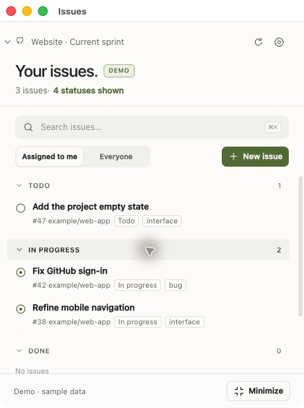

# Issues Electron

A compact GitHub Projects companion for **Windows and macOS**. This is a separate Electron implementation of [Issues](https://github.com/LucaCapasso22/Issues): the original Swift app, build scripts, settings, and credentials remain independent.



## Features

- Multiple GitHub Projects with a project dropdown and an isolated cache for each project.
- Issues grouped by the project's actual statuses, including custom statuses. Collapse individual sections and choose visible statuses with simple switches.
- Assigned to me / Everyone filters, search, automatic refresh every minute, and cached results when offline.
- Small issue details modal with full description, status changes, and multiple assignees, including clearing assignments.
- Issue creation with Markdown formatting and sanitized preview, repository templates, assignees, labels, milestones, issue types, additional projects, project status, parent issues, blocking relationships, and Create another.
- Queued image/video attachments uploaded when you create the issue. Successful uploads are retained during retries. Up to 10 files; images up to 10 MiB and videos up to 100 MiB each.
- Continue on GitHub for structured issue forms and workflows that require GitHub's web interface. The draft remains in the app; unsupported metadata must be set on GitHub. Copilot is not included.
- A borderless floating icon, in-progress count with hover preview, and a compact pinned-issue view. Edge-aware placement, dragging, and saved window positions.
- Tray/menu access, a global shortcut, and an optional always-on-top setting.
- Anime.js animations, reduced-motion support, and an entirely English interface.
- Interactive demo data for two projects, without creating real GitHub issues.

Repository metadata lists are limited to the first 100 entries where GitHub's APIs require bounded choices; the composer shows warnings when options may be missing. Draft project items and pull requests are not shown as issues.

## Run from source

Install Node.js 22 or newer, then run from the repository root:

```sh
cd electron
npm ci
npm start
```

Preview without a GitHub connection:

```sh
npm run demo
```

No Swift or Xcode toolchain is required for this version. Windows 10 or later (x64) and macOS 13 or later are the intended desktop targets. Linux has not been validated.

## Connect GitHub

Paste a GitHub Projects URL, such as `https://github.com/users/USERNAME/projects/1` or `https://github.com/orgs/ORGANIZATION/projects/1`.

Choose either a personal token or the active [GitHub CLI](https://cli.github.com/) session. With GitHub CLI installed, run:

```sh
gh auth login --hostname github.com --web
gh auth refresh -h github.com --scopes repo,project,read:org
```

If you only need to add Projects write access to an existing session:

```sh
gh auth refresh -h github.com -s project
```

Reading requires Projects read access. Editing project status requires Projects write access; creating and assigning issues requires Issues write access to the selected repository. The token does not grant permissions your GitHub account lacks. Organization policies and SSO can impose additional requirements. Classic tokens use `repo` for private repositories and `project` for project writes.

The app finds `gh` on PATH and in common installation locations. Restart the app after installing GitHub CLI or changing PATH.

## Shortcuts and windows

| Action | Windows | macOS |
| --- | --- | --- |
| Show / hide Issues | Ctrl+Shift+I | Cmd+Option+I |
| Search | Ctrl+K | Cmd+K |
| Close a modal | Esc | Esc |

Closing the main window keeps the app available as a floating icon. Quit from Settings or the tray/menu. Hover the count badge to open the in-progress preview; move away to close it. Select Keep in focus from an issue to show its compact view.

The macOS global shortcut differs from the Swift app so both can remain open together.

## Build

Run inside `electron/`:

```sh
npm run check
npm test
npm run pack
```

Windows installer (best built on Windows):

```sh
npm run dist:win
```

Windows ZIP (extract the entire archive, then launch `Issues Electron.exe`):

```sh
npm run dist:win:zip
```

macOS ZIP:

```sh
npm run dist:mac
```

Artifacts are written to `electron/dist/`. The Windows target is x64; macOS defaults to the build machine's architecture. These commands do not publish releases. Distribution builds are unsigned and are not notarized; configure your own signing credentials before a signed public release. Automatic updates are not implemented.

Cross-compiling the NSIS installer from Apple Silicon can require Intel tooling/Rosetta. The Windows ZIP does not require that installer compiler. If packaging from an exFAT volume fails while reading ASAR integrity metadata, use an output folder on the internal macOS volume:

```sh
npm run pack -- --config.directories.output=/private/tmp/issues-electron-package
npm run dist:win:zip -- --config.directories.output=/private/tmp/issues-electron-windows
```

## Storage and security

Electron uses its own `Issues Electron` data directory:

- Windows: `%APPDATA%\Issues Electron`
- macOS: `~/Library/Application Support/Issues Electron`

Settings and project caches are local JSON files. Cached issue content is not encrypted. Personal tokens are encrypted using Electron's OS-backed `safeStorage`; the app refuses to store a token if secure encryption is unavailable. GitHub CLI credentials remain managed by GitHub CLI.

The renderer is sandboxed with context isolation and no Node.js access. GitHub requests and credential handling run in the main process. IPC actions are validated; local attachment paths are never sent to the renderer. External navigation is restricted to HTTPS GitHub links. Demo changes do not overwrite saved projects or credentials.

## Validation

Focused Node tests cover project/cache isolation, stale requests, serialized writes, creation and partial failures, attachment reuse, GitHub transport, credential persistence, IPC validation, and floating-window geometry/hover timing.

The packaged app has been exercised on macOS using demo data. Windows packaging is available, but runtime behavior on a Windows machine still needs verification, especially display scaling, multiple monitors, tray behavior, and hover transitions. A read-only GitHub CLI smoke test also verified repository composer metadata against the public Issues repository. Real GitHub mutations are covered by mocked transport tests rather than creating test issues on a live project.

## Layout and contribution

- `src/`: Electron bootstrap, window manager, persistence, GitHub client, and application state.
- `renderer/`: bundled HTML/CSS/JavaScript interface and vendored animation/Markdown libraries.
- `test/`: focused tests using Node's test runner.
- `scripts/`: cross-platform development and validation commands.

Keep Electron changes inside this folder to avoid coupling releases to the Swift app. Run `npm run check` and `npm test` before submitting a pull request. Report the OS, display scale, and reproduction steps for desktop issues, with credentials removed.

MIT licensed; see [LICENSE](LICENSE). Vendored dependencies retain their own license files in `renderer/vendor/`.
